# ocr_sederhana

a Application for scanning and detecting text 

## PENDAHULUAN 

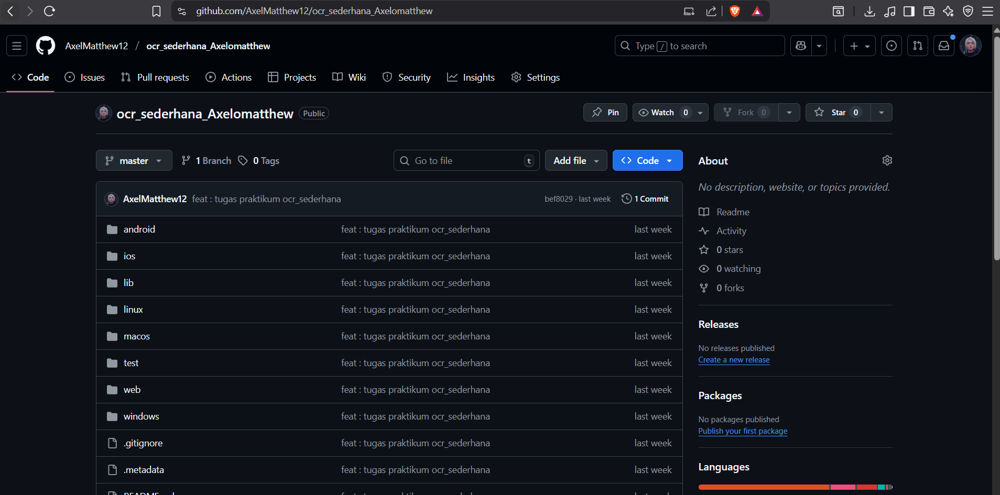
**Pada gambar diatas saya sudah melakukan pengerjaan untuk
OCR_SEDERHANA sebelumnya sampai selesai**

## Soal 1: Modifikasi Struktur Navigasi dan Aliran (30 Poin)
1. Pengubahan Navigasi Home (15 Poin):

**Tujuan: Menyederhanakan alur navigasi dan meningkatkan pengalaman pengguna di
HomeScreen.**

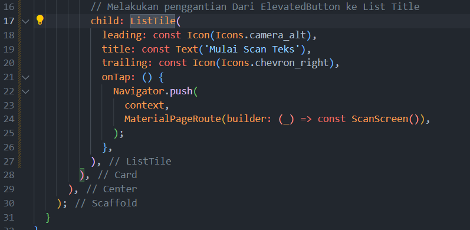
**|| Atur ListTile sesuai ketentuan ||**

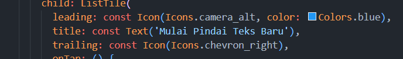
**|| Mengubah fungsi OneTap sesuai ketentuan UTS ||**
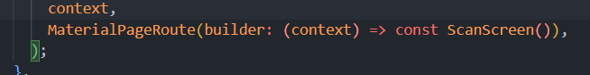

2. Teks Utuh dan Navigasi Balik (15 Poin):

**Before**
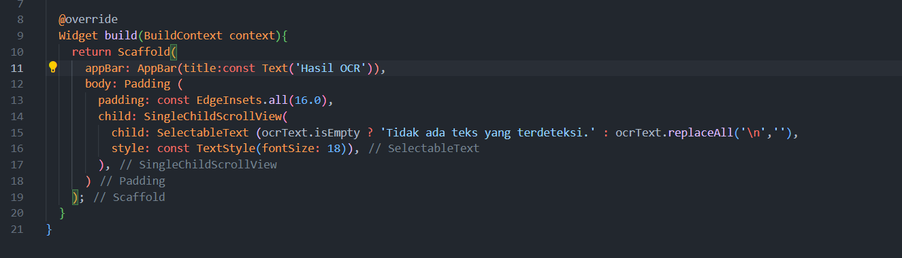

**After**

Menghilangkan hapus fungsi ocrText.replaceAllagar hasil teks ditampilkan dengan baris baru (\n) yang utuh.

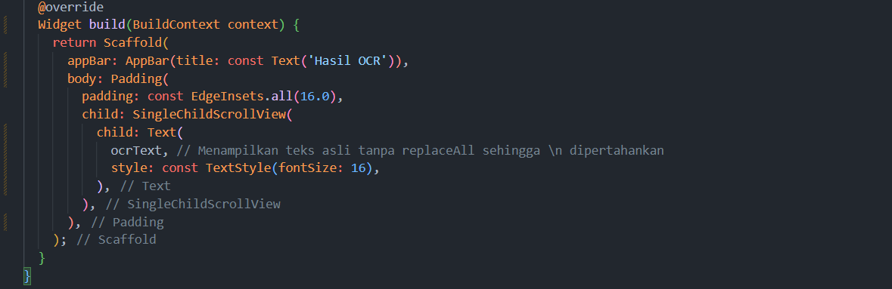

**Membuat floating ActionButton di result_screen.dart**
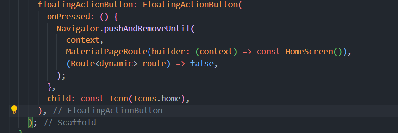

Memmbuat routing button kembali ke Home

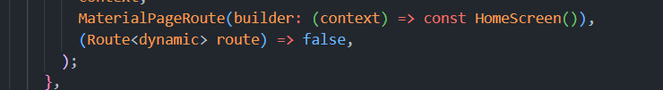

##
**HASIL**

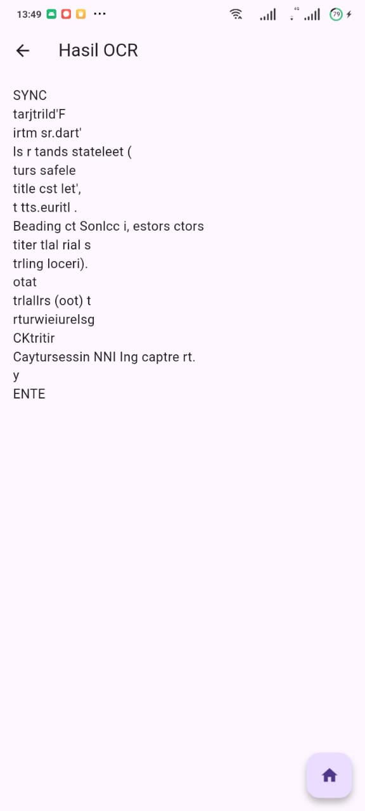

## Soal 2: Penyesuaian Tampilan dan Penanganan State/Error (40 Poin)

1. Custom Loading Screen di ScanScreen (20 Poin):
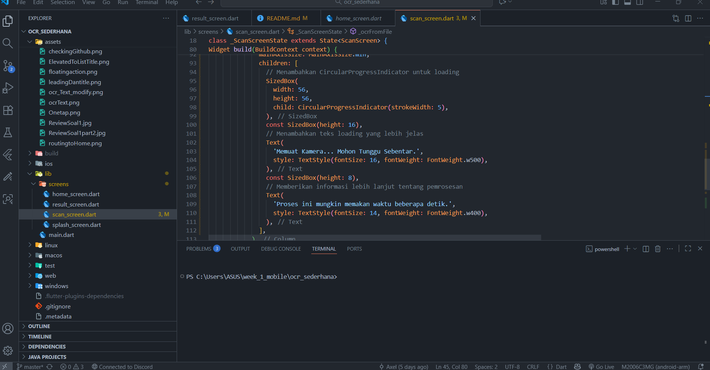

2. Spesifikasi Pesan Error (20 Poin):
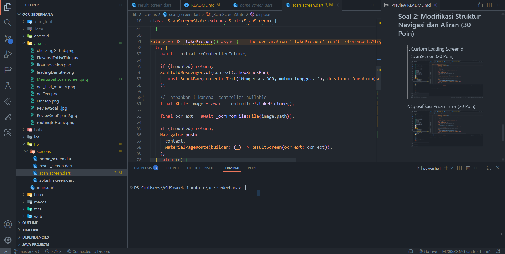

## HASIL UNTUK SOAL 2

## Soal 2: Modifikasi Struktur Navigasi dan Aliran (30 Poin)